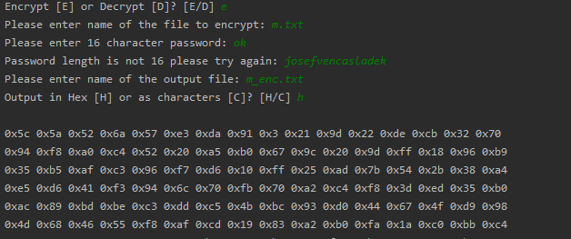

# Seminární práce z KIV-BIT
## Implementace symetrického šifrovacího algoritmu AES

V této seminární práci byl implementován šifrovací standard AES. Program umožňuje šifrování i dešifrování souboru 128 bitovým klíčem. Následuje obrázek s ukázkou použití programu.

